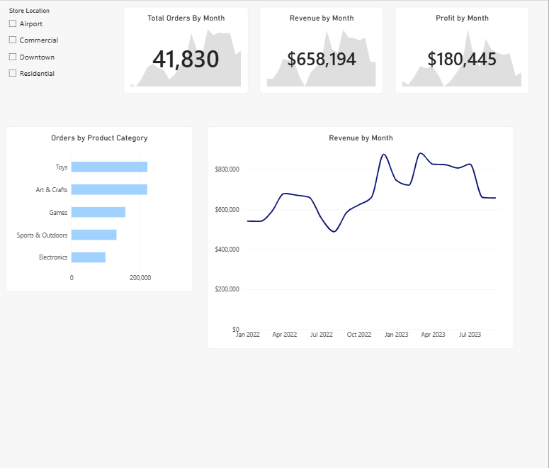

# Toy Store KPI Dashboard

## Project Overview

This project analyzes toy store sales performance using Microsoft Power BI. The dashboard was created as part of a Maven Analytics guided project and focuses on key performance indicators (KPIs), sales trends, product performance, and profitability.

The goal of the project was to transform raw sales data into an interactive dashboard that provides clear business insights and supports data-driven decision-making.

## Tools & Technologies

* Power BI
* Power Query
* DAX
* Data Visualization
* Data Cleaning & Transformation
* KPI Analysis

## Key KPIs

The dashboard analyzes several important business performance indicators, including:

* Total Revenue
* Total Profit
* Total Orders
* Units Sold
* Profit Margin
* Sales Performance

## Dashboard

## Analysis

The analysis focuses on identifying trends and patterns across the toy store's sales data. The dashboard provides an interactive way to evaluate overall business performance and compare different products and categories.

Key areas analyzed include:

* Overall sales and profitability
* Product performance
* Revenue trends
* Order volume
* Profitability
* KPI performance

## Key Findings

- Revenue was strongest in Arts & Crafts, making it the top-performing category.
- Arts & Crafts generated the highest overall profit.
- Glass Marbles accounted for the largest share of units sold.
- Overall profit margin was 27%, meaning the company keep $0.27 of every dollar sold.

## Project Files

| File/Folder  | Description                          |
| ------------ | ------------------------------------ |
| `data/`      | Source dataset used for the analysis |
| `dashboard/` | Power BI dashboard file              |
| `images/`    | Dashboard preview image              |

## Skills Demonstrated

This project demonstrates practical experience with:

* Data analysis
* Data visualization
* Business intelligence
* KPI development
* Power BI dashboard development
* Data cleaning and transformation
* DAX calculations
* Business-focused storytelling

## Project Type

Maven Analytics Guided Project

## Author

Kamal Khalil
